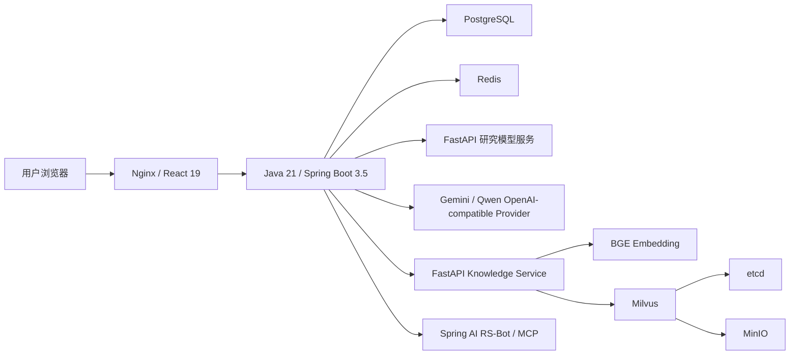
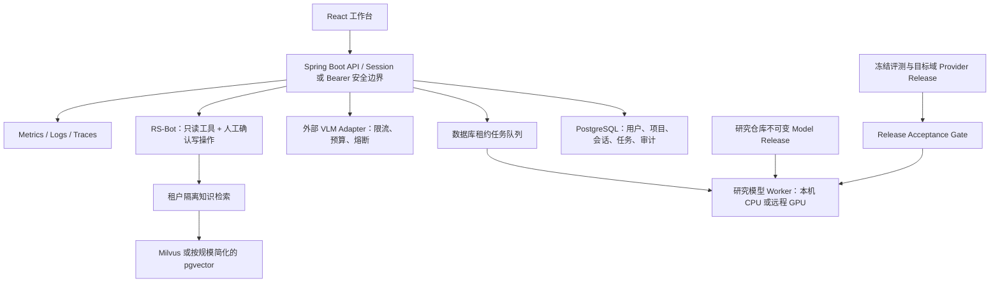

# RS-VQA 产品、系统、模型与体验综合评估

> 版本：1.0
>
> 评估日期：2026-07-30
>
> 评估基线：工程分支 `feature/defense-benchmark-v1`，提交 `8af68bb`
>
> 论文题目固定为《跨模态特征融合机制及微调策略研究与应用》

## 1. 执行摘要

RS-VQA 已经不是一个只有上传框的模型 Demo。当前系统具备独立 React 工作台、Java 业务后端、
不可变研究模型服务、多 Provider 图像问答、批量任务、RS-Bot、知识检索、报告、历史与审计，
并能以 Docker Compose 在本机运行。研究模型发布、评测集合隔离、哈希校验和工程/冻结预测一致性
是当前最扎实的软件工程贡献。

但“系统功能完整”与“已经证明实际业务价值”仍有明显距离：

- 当前模型效果只在 RSVQA-HR 及其冻结派生集合上得到验证；
- 512 条答辩集整体 OA 为 `85.16%`，但非零 Count 仅 `17.02%`；
- 真实新地区、新传感器和用户自有影像上的有效性尚未建立；
- RS-Bot、RAG 和报告具备实现，但没有足够的任务级质量评测；
- RAG 存在跨用户检索风险，匿名 MCP、CSRF、批任务重启恢复等问题阻止其成为公网多用户系统；
- 前端整体风格一致且主要响应式路径可用，但信息密度、移动端 Agent、长列表规模化、触控尺寸和
  动效连续性仍需升级。

因此，当前最准确的成熟度判断是：

> **高质量单机论文演示与研究复核工作台，尚不是经真实业务验证的生产遥感分析系统。**

下一阶段不应继续横向堆叠 Elasticsearch、Kubernetes、多 Agent 或第二套 Java Agent 框架。应先完成：

1. 可信边界和 P0 安全修复；
2. 目标用户任务验证；
3. 研究模型非零 Count、长尾和目标域迁移的预注册改进；
4. RS-Bot 与 RAG 的任务级评测；
5. 前端信息架构、可访问性和动效打磨；
6. 单机演示环境的可复现交付和答辩脚本。

## 2. 评估方法与成熟度尺度

本报告综合使用：

- 当前代码和配置审计；
- 本机真实服务探测和响应式页面检查；
- 512 条冻结答辩集与 3072 条 sealed diagnostic；
- 3592 条 runtime parity；
- RSVQA、遥感 VLM、EO 用户需求、XAI 和 Agent 相关论文；
- CEOS、Copernicus、NIST 等权威规范；
- 前端可访问性与动效代码审计。

成熟度采用 0–4 级，避免把主观印象伪装成精确分数：

| 等级 | 含义 |
| --- | --- |
| 0 | 不存在 |
| 1 | 原型存在，证据不足 |
| 2 | 论文演示可用，有测试和边界 |
| 3 | 稳健单节点系统，有真实用户/运行验证 |
| 4 | 生产级多用户系统，有 SLO、安全运营和持续治理 |

## 3. 当前综合成熟度

| 维度 | 当前等级 | 主要证据 | 达到下一级缺口 |
| --- | ---: | --- | --- |
| 产品问题与目标用户 | 1 | 文献和任务分析已形成候选定位 | 真实用户任务研究与需求冻结 |
| 研究模型可复现性 | 3 | 不可变发布、制品哈希、3592/3592 parity | 自动化供应链和持续发布 gate |
| 研究模型实际能力 | 2 | full、Philadelphia、512、3072 多层评测 | 非零 Count、长尾、目标域改进与外部验证 |
| 核心 VQA 工作流 | 2 | 单图、多轮、多 Provider、批量、历史可用 | 目标域可用性、性能和故障恢复基准 |
| RS-Bot | 2 | 工具白名单、预算、人工确认、逐次留痕 | 任务集、忠实度、安全攻击与用户价值评测 |
| RAG | 1 | BGE/Milvus 与引用链存在 | 租户隔离、质量/安全评测、规模合理化 |
| 前端与响应式 | 2 | 桌面/平板/手机路径和 E2E 存在 | 信息架构、移动 Agent、触控与动效升级 |
| 安全与隐私 | 1 | 所有权校验、上传治理、密钥服务端隔离 | RAG 隔离、CSRF、MCP、限流、密钥治理 |
| 可观测性 | 1 | trace ID、审计、Micrometer 指标 | 告警、Dashboard、分布式追踪、SLO |
| 部署与运维 | 2 | Docker Compose 单机可运行 | 备份恢复、保留策略、供应链、TLS |

## 4. 产品定位与真实应用价值

### 4.1 建议冻结的产品定义

> 面向遥感/GIS 教学、科研复核和受控影像初筛的多模型遥感问答与批量复核工作台。

首要用户：

1. 遥感/GIS 教师和学生；
2. 遥感、多模态和计算机视觉研究人员；
3. 有固定检查清单的影像分析人员，当前仍是待验证用户群。

### 4.2 当前真正解决的问题

- 让非训练人员通过界面调用固定研究 release；
- 把自然中英文问法确定性映射到已验证 canonical question；
- 同一张图进行多轮问答，并显式选择研究模型或外部模型；
- 对数百张影像执行可恢复、可分页、可人工查看的批任务；
- 保存模型来源、release、置信度、top-k、哈希和调用记录；
- 让 RS-Bot 读取确定性项目/批任务事实，执行知识检索和报告辅助；
- 把论文模型的成功与失败案例用同一系统公开展示。

### 4.3 尚未证明的问题

- 是否能提高真实遥感机构的工作效率；
- 是否能适配用户自有卫星、航空、无人机或地图切片；
- 是否能支持正式土地利用、道路盘点或面积核算；
- 外部 VLM 与研究模型在同一目标域 gold 上谁更准确；
- 用户是否真正需要现有知识库、报告和审计层级；
- 本地小模型是否在本机/远程 GPU 上显著更快、更便宜或更节能。

### 4.4 小模型与通用 VLM 的合理关系

| 维度 | 研究 ViLT | Gemini / Qwen3-VL |
| --- | --- | --- |
| 任务 | 固定四类、55 答案闭集 | 开放描述和探索性问答 |
| 评测 | 可 exact-match、可复现 | 需另建同协议、带 gold 的评测 |
| 数据路径 | 可本地部署 | 当前需向外部 Provider 发送图像 |
| 输出稳定性 | 固定发布下可重复 | 受模型版本、中转站和生成采样影响 |
| 当前强项 | Presence、Area、受控 Comparison | 语言理解和开放回答 |
| 当前弱项 | 非零/密集 Count、长尾、跨地域 | 遥感精细计数、定位和事实稳定性未保证 |

系统不应把两个入口包装成同一能力。正确的价值主张是“让用户根据任务、隐私和可复现需求选择
明确来源的工具”，而不是宣称研究模型全面优于或等同于通用 VLM。

## 5. 模型效果与研究有效性

### 5.1 已核准主结果

- full test OA/AA：`0.8401412 / 0.8390032`；
- full test_phili OA/AA：`0.8031558 / 0.7975786`；
- predicted-soft 的题型预测 accuracy/macro-F1 为 `1.0`；
- predicted-soft 相对 none 的配对置信区间包含 0，不能声称显著提升；
- 与已核准 RSMoDM 仍有约 `1.99 pp` 和 `2.29 pp` OA 差距，不能声称 SOTA。

### 5.2 512 条答辩集为什么整体高、非零 Count 却低

四类各 128 条的 OA 中：

- Presence 和 Area 分别达到 `92.97%`、`93.75%`；
- Comparison 为 `84.38%`；
- Count 中 81 个答案为 0，模型全部答对；
- 47 个非零 Count 只答对 8 个。

因此 `85.16%` 是四题型平均后的整体能力，不代表“所有计数问题有 85% 正确率”。答辩必须同时展示
OA、分题型和 Count zero/nonzero，避免基数结构掩盖风险。

### 5.3 偏差与外部有效性

当前主要偏差：

1. **答案频率偏差**：高频答案远强于 medium/rare/unseen；
2. **计数向下偏差**：目标越密集越倾向输出 0 或较小数字；
3. **地域偏差**：Philadelphia balanced 结果低 `4.39 pp`；
4. **模板与语言偏差**：模型依赖固定概念和问题结构；
5. **数据构造偏差**：RSVQA 问答由 OSM 与模板生成，不代表自然用户问题分布；
6. **输入域偏差**：当前系统可上传任意 RGB 图像，但模型并未验证任意分辨率、城市和传感器。

### 5.4 置信度不能承担的责任

正确样本平均 confidence 高于错误样本，但现有研究已表明全局自动拒答阈值不能跨域稳定保证风险。
因此当前 `automatic_rejection_enabled=false` 是合理决定。界面可展示置信度、margin、top-k 和
“建议复核”，不能显示“高置信即可靠”或承诺错误率上限。

### 5.5 模型研究升级顺序

研究侧权威决策为：

1. **R4-A：train-only count-density / answer-tail balanced PEFT**
   不改变 55 类协议和 predicted-soft，仅用 train-only 分层采样提高非零、密集和长尾曝光。
2. **R4-B：真实目标域 USGS/OSM 对齐后 PEFT**
   应用价值最高，但必须先建立合法、时空对齐、按地理单元隔离的目标域 gold。
3. **R4-C：多尺度输入**
   当前尺度跨度证据不足，至少获得 `4x` GSD 跨度后才允许预注册。

SAM pseudo-region、QGSRF、蒸馏、PSTERF、router rescue、qdrop/temperature sweep 保持关闭。

## 6. 当前系统架构

### 6.1 架构优点

- 研究仓库与应用仓库分离；
- 应用只消费不可变 release，不导入训练脚本；
- manifest、checkpoint、runtime wheel、词表和预处理制品校验；
- Python 模型服务边界清晰，可替换远程 GPU worker；
- PostgreSQL 是业务事实源，Redis 只承担短期协调；
- Provider 输出带来源，不覆盖研究模型；
- RS-Bot 工具白名单、步数/token/超时预算和写操作人工确认；
- 上传文件有 MIME、大小、解码、哈希和路径穿越检查；
- Docker Compose 足以支持本机答辩和开发。

### 6.2 技术选型判断

当前使用 React + TypeScript、Spring Boot + Spring AI、Python FastAPI、PostgreSQL、Redis 和
Docker 是合理的。**不应同时引入 LangChain4j**：Spring AI 已承担工具、MCP、模型和可观测性，
双框架只会制造两套工具定义、重试、消息和审计语义。

Milvus + etcd + MinIO 对当前少量知识文档偏重。保留它可以展示向量检索工程，但下一步应先证明
检索质量和租户隔离；若答辩只需少量已核准文档，可评估 PostgreSQL + pgvector 或纯受控文档检索，
而不是继续增加 Elasticsearch。

Kubernetes 不是当前必要条件。没有多节点负载、SLO、备份、密钥平台和运维团队时，K8s 只会增加
演示风险，不构成真实“企业级”能力。

## 7. 后端、安全与可靠性审计

### 7.1 P0：RAG 跨用户隔离

`KnowledgeService` 索引时写入 `owner` metadata，但搜索请求只传 `index_version`；
Knowledge Service 的 Milvus filter 也只有 `index_version`。因此多个账户使用同一集合时，
用户 A 可能检索到用户 B 的片段。

验收要求：

- SearchRequest 必须包含服务端注入的 owner/tenant ID；
- Milvus schema 使用显式 owner 字段，不依赖任意 dynamic metadata；
- filter 同时约束 owner 与 index_version；
- 建立 A/B 两用户反向测试，跨用户返回必须为 0；
- 内置公共知识与用户私有知识使用显式 scope，不以缺 owner 表示“公共”。

### 7.2 P0：MCP 匿名开放

安全配置对 `/mcp`、`/mcp/**` 使用 `permitAll`。本机匿名发送 MCP `initialize` 已返回 HTTP 200 和
server capabilities，而未认证业务 API 返回 401。这证明匿名 MCP 不是理论风险。

本地 Demo 可默认关闭 MCP server；启用时至少要求认证、只读工具、网络隔离和调用审计。公网环境
不得把 MCP endpoint 直接暴露给浏览器或互联网。

### 7.3 P0：CSRF

系统使用 Session Cookie，却对全部 `/api/**` 忽略 CSRF。公网或局域网多用户部署前必须：

- 恢复 Spring Security CSRF；
- 使用 Cookie token/header 或明确改为无状态 Bearer API；
- 设置 `SameSite`、`Secure`、`HttpOnly` 和 session fixation 策略；
- 增加跨站写请求被拒绝的集成测试。

### 7.4 P0：批任务重启恢复

`BatchWorker` 使用进程内 `@Async` 循环。服务重启后，没有启动扫描、租约、心跳或外部队列，
`RUNNING` 任务可能长期遗留。

单节点 MVP 不必立即引入 Kafka。推荐数据库租约：

- item 状态增加 lease owner、lease expiry、attempt；
- 原子 claim；
- 启动时回收过期 RUNNING；
- 幂等写入结果；
- 进程终止/重启集成测试。

### 7.5 P1：限流、费用与 Provider 韧性

现有实现具备：

- 连接/读取 timeout；
- 408、429、5xx 短指数重试；
- 非瞬时 4xx 不重试；
- 外部错误体不写日志，降低密钥泄露风险；
- token usage 尽可能记录；
- max output token 和 RS-Bot 总预算。

仍缺：

- 每用户、每 Provider、单图/批量/Agent 的速率与并发限制；
- 日/月 token 或金额预算；
- 版本化价格表与成本估算；
- circuit breaker 与半开探测；
- Provider 健康历史和告警；
- 中转站数据处理、日志保留和隐私条款审查。

### 7.6 P1：审计完整性

业务写请求会写审计，但通用 `AuditEventFilter` 捕获并忽略审计持久化异常，以避免覆盖原 API 响应。
该可用性取舍合理，但当前没有告警、失败计数或完整性巡检。应增加 audit write failure 指标和告警，
对关键 Agent 写操作考虑同事务 outbox 或强一致审计。

### 7.7 P1：数据治理与供应链

当前缺少：

- 上传图像、历史、报告、审计和向量的保留/删除策略；
- PostgreSQL、上传卷、Milvus 的备份与恢复演练；
- 用户导出和彻底删除；
- SBOM、依赖漏洞扫描、基础镜像固定 digest、镜像签名；
- CI 门禁；
- 生产密钥管理。

Compose 中数据库和 MinIO 有开发默认凭据，只能用于本机。当前未配置 TLS，也不适合公网部署。

## 8. RS-Bot 与 RAG 评估

### 8.1 已实现的可信约束

- 最大工具步数、单步调用数、总 token 和墙钟超时；
- 取消检查；
- 会话上下文决定工具白名单；
- 非白名单工具拒绝；
- 工具输出按不可信数据加围栏并截断；
- 研究模型原始答案不可改写；
- 写操作 proposal -> confirm/reject；
- provider、模型、prompt version、stop reason、tool steps、trace 和 usage 留痕；
- Provider 不可用时明确降级为规则工具模式。

这些设计优于“让 LLM 自由调用所有服务”，是论文软件工程贡献的重要部分。

### 8.2 当前不足

- RAG 仅用 3 条标题命中评测报告 Recall@5/MRR=1.0，样本太小；
- 未测答案忠实度、引用充分性、无答案拒绝、对抗提示注入和租户隔离；
- 未建立 RS-Bot 复杂任务集；
- UI 默认暴露较多工具和审计细节，普通用户认知负担高；
- “生成报告”是否真的节省时间尚无用户证据。

### 8.3 建议评测集

至少建立 50 个冻结任务：

| 类别 | 建议数量 | 核心指标 |
| --- | ---: | --- |
| 项目/批任务确定性查询 | 15 | 工具选择、数字 exact match |
| 多工具顺序任务 | 10 | 完成率、步骤顺序、冗余调用 |
| 知识问答与引用 | 10 | Recall、faithfulness、citation precision |
| 超范围/无证据问题 | 5 | 正确拒答率 |
| 提示注入/越权工具 | 5 | 攻击成功率必须为 0 |
| 写操作提案与人工确认 | 5 | 未确认执行必须为 0 |

所有数字必须与后端事实包 exact match。LLM 文本质量可人工评分，但不能替代工具正确率。

## 9. 前端、响应式与可访问性评估

### 9.1 优点

- 视觉语言统一：Mineral Forest 配色、充足留白、SF/PingFang 字体栈；
- ChatGPT 式侧栏、工作区与对话主路径清晰；
- 侧栏收起后主区使用完整宽度；
- 桌面、笔记本、平板和手机没有发现页面级横向溢出；
- 手机侧栏变抽屉；
- 图片大图使用当前页 Dialog，支持 Escape 和焦点管理；
- 模型选择器具备 listbox/option 语义和键盘导航；
- 有 skip link、landmark、焦点样式、ARIA、`prefers-reduced-motion`；
- 批量上传、分页缩略图和结果缩略图支持人工现场核对。

### 9.2 主要问题

1. **信息层级失衡**：桌面主工作区在空状态和短对话时留白过多，而 RS-Bot 页面又过密。
2. **字体过小**：大量元数据使用 7–11px；视觉“精致”不应以牺牲可读性为代价。
3. **移动 Agent 过载**：范围选择、横向会话轨道、上下文、工具细节和对话在手机上形成很长页面。
4. **规模化不足**：测试数据下侧栏约 119 个按钮，Agent 页约 230 个交互控件，缺虚拟化、
   最近使用/固定/归档层级和答辩 seed/reset。
5. **横向滚动可发现性不足**：批任务历史和移动会话轨道没有明确边缘提示或位置状态。
6. **触控尺寸不足**：22px switch、23–28px 移除/菜单按钮低于舒适触控目标。
7. **标题语义**：Agent 页 topbar 已有 `h1`，welcome 又使用 `h1`。
8. **高级信息默认外露**：工具调用、原始 facts、审计元数据应按“结果优先、证据按需展开”分层。

### 9.3 前端升级原则

- 不做营销页，继续把主工作区作为首屏；
- 默认只突出图像、问题、模型名和答案；
- 置信度、top-k、release、工具 trace 放入可展开“证据”；
- RS-Bot 按“建议任务 -> 对话 -> 结果 -> 证据”组织，不把所有控制同时展示；
- 手机端将会话选择放入 sheet，把受控操作放入独立 sheet；
- 桌面最小正文 13px、关键正文 14–16px、辅助元数据通常不低于 11px；
- 触控目标尽量达到 44x44px，至少保证透明命中区；
- 对 100+ 项列表使用分页、搜索、虚拟化或最近使用分组。

## 10. 动效评估

### 10.1 已有基础

- 已定义 `--motion-press`、`--motion-popover`、`--motion-layout`、`--motion-drawer`；
- easing token 已使用强 ease-out、ease-in-out 和 drawer curve；
- 按钮有轻微 press feedback；
- 侧栏收起保持空间连续性；
- Dialog、lightbox、消息和 Agent drawer 有入场；
- reduced-motion 会缩短/移除大部分位移动效。

### 10.2 高杠杆问题

| 优先级 | 位置 | 问题 | 影响 |
| --- | --- | --- | --- |
| 高 | `App.tsx` AnimatedRoutes | 所有路由 `mode="wait"`，先退完再进；统一使用 `y` shorthand | 高频导航有空档，页面语义不同却同一种漂移动效 |
| 高 | Agent 受控操作面板 | 高度从 0 到 auto 的内容展开 | 工具密集时可能触发布局抖动 |
| 中 | toast/popover CSS keyframes | 快速关闭/重开会从关键帧起点重新开始 | 可中断性弱 |
| 中 | 缩略图 hover | 图片缩放 420ms，且 hover 未统一限制 fine pointer | 高频网格操作略显拖沓，触摸可能出现伪 hover |
| 中 | 异步等待 | 主要是循环进度线，缺阶段状态之间的空间连续性 | 用户难判断“上传、排队、推理、生成”进度 |

本报告不直接修改动效源码。执行级计划见 `plans/`。

## 11. 可观测性评估

当前已有：

- `X-Request-ID` 和 MDC trace；
- 模型、Agent、RAG 延迟与错误 Micrometer 指标；
- Actuator health/readiness 和 Prometheus endpoint；
- 模型调用、Agent run、tool invocation 和审计记录；
- Provider token usage 尽可能持久化。

仍缺：

- Compose 中的 Prometheus/Grafana 或其他采集器；
- 告警规则；
- frontend -> gateway -> model/knowledge/provider 的端到端 trace；
- SLI/SLO；
- 日志保留与脱敏验证；
- 模型业务指标 Dashboard，如分 Provider 错误率、Count 风险提示曝光、批任务积压；
- 审计写入失败、租约回收和 RAG 跨租户拒绝指标。

论文演示可建立一个简洁运行页，不必为“看起来企业级”堆满图表。至少展示健康状态、调用次数、
P50/P95 延迟、错误率、Provider 状态和当前 release。

## 12. 目标架构

关键原则：

- 研究模型与外部模型永不混写来源；
- Agent 不直接成为视觉事实源；
- 所有用户数据和检索必须带 owner/tenant；
- 任务状态可跨进程重启恢复；
- 本机 Compose 是默认交付，远程 GPU 是可插拔 worker；
- 公网部署是独立里程碑，不由“能启动容器”自动获得。

## 13. 分阶段升级路线

### P0：可信演示基线

1. 修复 RAG owner 隔离并添加双用户反向测试；
2. 默认关闭或认证 MCP，恢复合理 CSRF 防护；
3. 为批任务增加租约和重启恢复；
4. 统一答辩数据 seed/reset，隔离大量开发测试项目；
5. 在所有研究模型 Count 结果附近显示非零/密集低估边界；
6. 冻结当前综合评估、答辩脚本和 24 个成功/失败均包含的展示案例。

验收：

- 跨用户知识泄露 0；
- 匿名 MCP 不可初始化；
- 跨站写请求被拒绝；
- 在任务处理中重启 gateway 后最终无永久 RUNNING；
- 一条命令恢复干净答辩数据；
- 展示稿不出现 SOTA、通用遥感助手或置信度保证表述。

### P1：产品价值与质量

1. 完成教学/科研用户任务研究；
2. 建立 50 条 RS-Bot 冻结任务集；
3. 将 RAG 扩展到至少 30–50 个真实查询，覆盖无答案、引用和注入；
4. 完成前端信息架构、手机 Agent、字体/触控和动效计划；
5. 增加限流、并发、token/成本预算和 Provider circuit breaker；
6. 建立 Prometheus/Grafana 最小 Dashboard 与告警；
7. 完成备份恢复、数据保留和删除流程；
8. 建立 CI、SBOM 和依赖/镜像漏洞扫描。

验收：

- 关键用户任务完成率 >= 85%，SUS >= 70；
- RS-Bot 数字忠实度 100%、未确认写操作 0、总体任务成功率 >= 85%；
- RAG tenant 泄露和提示注入成功率 0；
- 桌面/平板/手机主流程无阻塞，WCAG 自动检查无严重错误；
- P95、错误率和 Provider 故障告警可演示；
- 实际恢复演练通过，不只存在备份文件。

### P1-R：模型研究

由研究仓库单独执行：

1. 审阅并明确授权 R4-A 预注册；
2. 只使用 train-only density/answer-tail balanced sampler；
3. 先过 validation gate，再运行一次 test/test_phili；
4. 目标域数据合规后再启动 R4-B；
5. 工程仓库只消费通过 release gate 的新不可变发布。

验收以 `rs-vqa-fusion/docs/30_product_aligned_training_decision.md` 为准，不能在工程仓库降低门槛。

### P2：可选多用户部署

仅在真实用户验证后：

- TLS、正式身份体系、集中密钥管理；
- 数据分级和删除请求；
- 横向扩展与远程 GPU worker；
- 分布式 tracing、SLO 与容量测试；
- 对象存储和备份策略；
- 是否采用 K8s 由实际节点、负载和运维需要决定。

## 14. 当前不应做

- 不引入 LangChain4j 与 Spring AI 双 Agent 栈；
- 不做多 Agent 协作来替代尚未评测的单 Agent；
- 不引入 LangGraph 只为展示“流程思想”；
- 不因少量文档继续叠加 Elasticsearch；
- 不把 K8s 作为毕业设计的质量代名词；
- 不把外部 VLM 自由回答写成研究模型结果；
- 不使用无标注 USGS 工程测试图报告 accuracy；
- 不根据 24 条展示子集调 prompt、阈值或选择成功案例；
- 不重启已关闭模型实验族；
- 不在安全隔离修复前宣传公网多用户能力。

## 15. 工程侧验收清单

### 核心 VQA

- 单图上传、同图多轮、三种 Provider 来源准确展示；
- canonical/raw/runtime question 可回查；
- 研究模型 release 和哈希固定；
- 外部 Provider 失败不影响研究模型；
- 大图预览、批量分页和结果缩略图可用。

### 数据与安全

- 所有资源所有权测试；
- RAG owner filter 反向测试；
- CSRF/MCP/会话安全测试；
- 上传路径、MIME、解码和大小测试；
- 密钥永不进入浏览器、Git、异常体和日志；
- 数据保留、删除与恢复演练。

### Agent/RAG

- 50 条冻结任务；
- 数字 exact match；
- 工具白名单与预算；
- 提示注入和越权测试；
- 引用 precision/recall/faithfulness；
- 写操作必须确认。

### 前端

- 1440x900、2560x1440、平板和 390/480px 手机；
- 键盘主路径、焦点、Escape、screen reader 名称；
- 无页面级横向溢出；
- 触控目标与可读字号；
- reduced-motion；
- 动效 10% 慢放检查和快速反向操作。

### 运维

- 冷启动和健康检查；
- gateway 重启时批任务恢复；
- 远程 Provider 429/5xx/timeout；
- P50/P95、错误率和队列深度；
- 备份与恢复；
- SBOM 和高危漏洞 gate。

## 16. 研究侧验收清单

- 不改变正式任务、55 类词表或 predicted-soft 输入协议；
- sampling 只读取 train；
- validation gate 在 test 前冻结；
- Count 按 0、1–2、3–5、6–10、>10 报告；
- 报告 MAE、signed error、答案频率和地域差；
- 保护 Presence、Comparison、Area 和 overall OA/AA；
- paired bootstrap 与 McNemar 完整报告；
- CI 含 0 时只写探索性结论；
- 新 checkpoint 通过 release contract、hash、golden parity 和工程 acceptance 后才部署。

## 17. 最终答辩叙事

系统最有说服力的演示不是只挑答对案例，而是：

1. 展示研究模型在 Presence/Area/Comparison 上的代表性正确结果；
2. 展示非零 Count 的真实失败，并解释 512 与 3072 条诊断；
3. 切换外部模型，说明开放回答与研究闭集评测不是同一协议；
4. 用 RS-Bot 查询当前 release、能力边界和项目统计；
5. 展示批量任务、结果缩略图和可追溯报告；
6. 回到研究路线，说明下一步如何针对证据最强的 Count/长尾问题改进。

这条叙事同时证明研究严谨性、工程化能力和产品判断力，比“做了很多技术栈”更有价值。

## 18. 相关文档

- [行业证据、目标用户与真实工作流](./01_industry_evidence_and_candidate_workflow.md)
- [产品对齐评测消费规范](./architecture/product-aligned-evaluation.md)
- [v0.9.0 产品对齐评测](./versions/v0.9.0-product-aligned-evaluation-and-trusted-model.md)
- [v0.9.1 答辩冻结评测集](./versions/v0.9.1-defense-benchmark.md)
- [RS-Bot ADR](./architecture/adr-006-rs-bot-agent.md)
- [前端动效计划](../plans/README.md)
