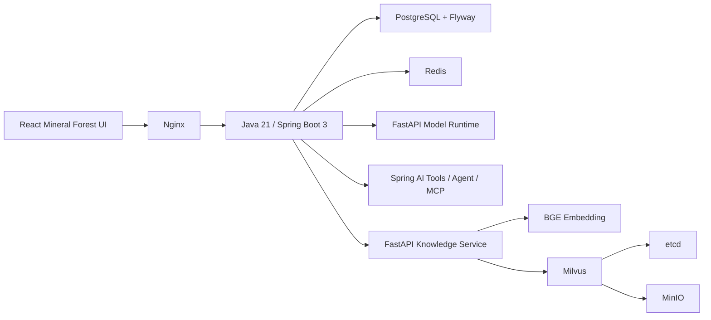

# RS-VQA v0.3.0 技术方案与功能介绍

> 状态：功能完成，真实研究 release 待研究仓库发布  
> 日期：2026-07-24  
> 论文：跨模态特征融合机制及微调策略研究与应用

## 版本目标与用户场景

v0.3.0 将 v0.1.2 的 Vue 单次 Mock 转发页升级为完整的遥感 VQA 应用：用户进入本地演示身份，按项目管理分析会话，上传一张遥感图像，自由输入同图多轮问题，获得带来源和版本的可信结果；进一步可运行可信单 Agent、检索带引用的知识库、创建可取消和可重试的批量任务。

本版本的核心演示闭环已经实际运行：

```text
演示身份 -> 项目/会话 -> 图像上传 -> 自由提问 -> 模型运行时
        -> 可信回答/拒答 -> 同图多轮 -> 刷新恢复 -> Markdown 报告
```

Agent、RAG 和 MCP 都是这个闭环的受控辅助能力，不能改写研究模型原始答案。

## 架构与技术栈



- 前端：React 19、TypeScript、Vite、Tailwind CSS 4、React Router、TanStack Query、React Hook Form、Zod、Zustand、Lucide、Vitest/RTL、Playwright
- 业务后端：Java 21、Spring Boot 3.5、Spring Web/Security/JPA/Validation、Flyway、Actuator、Micrometer、OpenAPI
- AI 应用层：Spring AI 1.1.8、结构化只读工具、SSE、MCP Server/Client 边界
- 模型服务：Python 3.12、FastAPI、Pydantic、独立 runtime adapter
- RAG：`BAAI/bge-small-zh-v1.5`、Milvus 2.6.20、CPU PyTorch 2.6
- 数据：PostgreSQL 17.5、Redis 8
- 部署：Docker Compose、Nginx

Spring AI 是正式编排层。LangChain4j 仅保留 ADR 对比结论，不与 Spring AI 叠加；当前没有值得复制业务逻辑的独立运行 PoC。Kubernetes、MySQL、Elasticsearch 和多 Agent 不进入本版本。

## 模块边界

| 模块 | 职责 | 明确不做 |
| --- | --- | --- |
| `apps/web` | 页面、上传、会话、模型选择、Agent/RAG/批任务交互 | 直接访问 Python 或保存业务事实 |
| `apps/gateway` | 身份、权限、文件、业务事实、协调、Agent、MCP、审计 | 加载 checkpoint 或训练模型 |
| `services/model-service` | release 校验、单图/批量推理、Mock/Real 适配 | 用户、项目和历史 |
| `services/knowledge-service` | 文本切分、BGE、Milvus、Top-K 引用 | 根据知识文本猜图像答案 |
| PostgreSQL | 所有核心业务事实 | 保存图像、checkpoint |
| Redis | 批任务短期快照与协调 | 替代 PostgreSQL |

## 页面与功能

### Mineral Forest 工作台

- 全浅色连续应用壳、276px 项目侧栏、白色对话区、固定输入器
- 项目、会话历史、新建项目、新建分析、对话搜索
- 图像上传、预览、尺寸/MIME/大小、查看大图、更换、删除
- 自由问题输入和示例问法，同图多轮消息
- 页面刷新后从 PostgreSQL 恢复图像、消息和历史 release
- 模型选择器动态读取 Provider 状态；外部 VLM 未配置时禁用
- 回答展示 `RESEARCH_MODEL` / `EXTERNAL_VLM` / `MOCK` 来源
- 低于 65% 展示阈值时保留原答案并提示复核
- 超出存在/数量/面积/比较四类问题时明确拒答
- 调用详情包含 release ID、置信度、耗时、request ID
- Markdown 报告导出

### 可信单 Agent

- 正式 Agent 目录包含六个只读工具和一个受控单图 VQA 工具
- 同步运行与 SSE 阶段流
- UI 展示接受、工具开始、完成、失败等阶段，并支持中止浏览器流
- 工具调用、Agent run、trace ID、耗时和输出摘要持久化
- 未配置外部 LLM 时使用规则驱动的只读编排，不伪造 LLM 回答
- 不提供 Shell、破坏性数据库、费用操作或任意文件访问

只读工具：

1. 当前模型 release
2. 支持的问题类型
3. 系统健康
4. 会话历史
5. 批任务状态
6. 知识库检索

受控写工具 `single_image_vqa` 只能在当前用户已有图像的会话中调用正式 VQA 主路径，并原样保存模型结果；它不会发布到只读 MCP Server。

### MCP

- Spring AI stateless sync MCP Server 挂载于 `/mcp`
- 实际完成 `initialize`、`tools/list`、`tools/call`
- JSON Schema 由 Spring AI 工具定义生成
- MCP Client 配置默认关闭；公共边界提供状态、发现和调用
- Client 仅允许上述六个只读名称，其他工具在调用前拒绝
- 10 秒请求超时、统一错误映射、API 审计和 Trace ID
- Java 集成测试使用 MCP SDK 真实连接 Nginx 后的 Server 并调用 `current_model_release`

### RAG

- 导入 UTF-8 Markdown/TXT，2 MiB 限制，哈希与状态入库
- 清洗、420 字符 chunk/70 overlap、本地 chunk 元数据
- CPU BGE 可配置模型；默认 `BAAI/bge-small-zh-v1.5`
- Milvus COSINE/AUTOINDEX、strong consistency、索引版本过滤
- Top-K、阈值、文档删除、内置已核准边界文档
- React 展示 embedding model、collection、分块、相似度与来源
- RAG 只解释模型和系统资料，不能替代图像 VQA

在已核准边界文档上执行 3 条检索基准：

| 指标 | 结果 |
| --- | --- |
| case count | 3 |
| Recall@K | 1.0 |
| MRR | 1.0 |

### 批量 VQA

- 多图上传和逐文件校验
- 问题添加、编辑、删除
- 图像 × 问题组合、任务和逐项状态
- PostgreSQL 保存权威任务状态，Redis 保存短期快照
- 单项失败不丢失其他进度
- 总进度、成功/失败、逐项答案/来源/置信度/错误
- 中途取消、只重试失败项、CSV 导出
- `RSVQA_MOCK_LATENCY_MS` 只用于自动化构造可观察的取消窗口

实际取消验收：32 项任务在第 1 项完成后取消，最终为 `CANCELLED`，1 项 `COMPLETED`、31 项 `CANCELLED`。

## 数据模型

Flyway V1–V4 已实现 14 个核心实体：

`User`、`Project`、`Conversation`、`Message`、`ImageAsset`、`ModelRelease`、`ModelInvocation`、`AgentRun`、`ToolInvocation`、`BatchJob`、`BatchItem`、`KnowledgeDocument`、`KnowledgeChunk`、`AuditEvent`。

本地账户密码使用 BCrypt 12；USER/ADMIN、Session、项目隔离和管理员审计边界已存在。React 默认自动进入受控 demo 身份，并明确显示 `Demo workspace`，不把它描述为完整公网认证系统。

## 模型运行模式

| 模式 | 当前状态 | 输出来源 |
| --- | --- | --- |
| Mock Runtime | 已运行 | `mock_demo` |
| Real Runtime | 代码和测试边界已完成，release 缺失 | `research_vilt_predicted_soft` |
| 外部通用 VLM | Provider 抽象已完成，未授权/未配置 | `external_vlm_assist` |

Mock release ID：

`mock-demo-not-a-research-release`

真实 release ID 与 checkpoint SHA-256：**无，不能伪造**。

Real Runtime 已实现：

- Pydantic manifest Schema
- `contract_version=1.0`
- `rsvqa_hr_grouped_answer_closed_set`
- `type_source_mode=predicted_soft`
- 拒绝 release ID 中的 oracle/routed/mock
- 路径穿越防护
- checkpoint、答案词表和 runtime artifact SHA-256
- 可插拔 `package.module:factory`
- 加载、预热、输入和输出验证
- `/health`、`/ready`、`/models/current`、`/v1/vqa`、`/v1/vqa/batch`

当前研究仓库的规范文件尚未形成可固定的真实 release，故未进行 AutoDL 付费开机和 checkpoint 下载。这是外部发布物阻塞，不影响 Mock 全栈演示。

## API

完整路径、示例和错误格式见 [v0.3.0 API、数据与运行时契约](../architecture/v0.3.0-contracts.md)。Springdoc OpenAPI、Actuator readiness/liveness 和 Prometheus metrics 已启用。

## 安全与治理

- MIME、扩展名、10 MiB、可解码图像、尺寸和 WebP 头校验
- 内部 UUID 文件名、原名清理、SHA-256、受控存储根、临时文件 finally 清理
- Spring Security 默认保护业务 API；用户只能读取自身项目/图像/任务/文档
- Nginx 是浏览器唯一入口，模型、数据库、Redis、Milvus 不对浏览器开放
- 错误统一为 `code/message/requestId/timestamp/details/retryable`
- ECS 结构化日志、Trace ID、Micrometer 模型/Agent/RAG/批任务指标
- 审计不记录 Authorization、Cookie、密码、token、API key 或图像内容
- `.env`、模型、checkpoint、上传图像、预测、日志和数据目录均被忽略

## 部署

Mock + RAG：

```bash
docker-compose --profile rag up -d --build
```

访问：

<http://127.0.0.1:8088>

Real 模式使用 `compose.real.yaml` 覆盖层，并强制要求 manifest 路径和独立 runtime entrypoint。Docker volumes 保存 PostgreSQL、Redis、上传文件、Milvus/etcd/MinIO 和 BGE 缓存。

## 测试与验收结果

| 范围 | 命令 | 结果 |
| --- | --- | --- |
| React 类型 | `npm run typecheck` | 通过 |
| React 单元 | `npm run test -- --run` | 3 files / 7 tests 通过 |
| React 构建 | `npm run build` | 通过 |
| Playwright | `npm run test:e2e` | 6/6 通过，无重试 |
| 模型服务 | `.venv/bin/python -m pytest -q` | 19/19 通过 |
| 知识服务 | 容器内 `pytest -q` | 3/3 通过 |
| Java 常规 | `mvn test` | 15 通过；2 个外部集成测试默认跳过 |
| Java Compose 集成 | 环境开关运行 persistence + MCP | 2/2 通过 |
| RAG 检索评测 | `evaluate_retrieval.py` | Recall@K=1.0，MRR=1.0 |

Playwright 实际覆盖：

- 演示身份
- 上传与预览
- 多轮提问
- 刷新恢复
- Mock 来源
- 低置信度
- 超出范围
- Agent 工具与审计
- BGE/Milvus 引用
- 批任务与 CSV
- 1440 桌面、1280 笔记本、1024 平板、iPhone 13

截图位于被忽略的测试产物目录：

- `apps/web/test-results/.../workspace-desktop.png`
- `apps/web/test-results/.../workspace-laptop-chromium.png`
- `apps/web/test-results/.../workspace-tablet-chromium.png`
- `apps/web/test-results/.../workspace-mobile.png`
- `apps/web/test-results/.../batch-desktop.png`
- `apps/web/test-results/.../batch-mobile.png`

视觉检查确认：Mineral Forest 全浅色布局、侧栏/顶栏稳定、图片不失真、消息不重叠、Agent drawer 不遮挡桌面回答、移动端侧栏关闭后无残留、输入器保持可用。

## 功能验收追踪

| # | 验收项 | 状态与证据 |
| --- | --- | --- |
| 1–3 | 演示身份、创建项目、创建会话 | 已通过 Nginx 运行 API 与 Playwright |
| 4–7 | 上传、预览、更换、删除图像 | 已实测两张 1024×1024 图像替换、SHA-256 改变、删除后 `image=null` |
| 8–10 | 自由问题、单轮、同图多轮 | Playwright 真实 API；刷新前后消息数量一致 |
| 11 | Mock 研究协议 | `mock_demo` + `mock-demo-not-a-research-release` 全链路明确标记 |
| 12 | 真实研究模型 | 运行边界完成；研究侧没有不可变 release，未伪造 |
| 13–14 | 低置信度、超出范围 | Playwright 分别验证 59.5% Mock 提示和火灾风险拒答 |
| 15 | 历史恢复 | Playwright reload 后恢复图像和多轮消息 |
| 16–18 | 模型信息、选择、Provider 未配置 | `/providers` 和 UI 实测；外部 VLM 为 `UNCONFIGURED` |
| 19 | Agent Tool Calling | UI 只读工具及运行 API 的 `single_image_vqa` 均完成并记录 |
| 20 | MCP 只读工具 | Java MCP Client 实际 initialize/list/call，严格 6 个工具 |
| 21–22 | RAG 检索与来源 | BGE/Milvus 实链路、React citation 和 3 条检索评测 |
| 23–24 | 批任务与进度 | Playwright 创建任务并逐项完成，CSV 可下载 |
| 25 | 取消 | 32 项任务实测为 1 completed + 31 cancelled |
| 26 | 失败项重试 | 无效 release 任务实测 attempt count 从 1 增至 2 |
| 27 | 错误恢复 | 会话重试、请求超时/取消、文件/Provider/RAG/MCP 错误映射已测 |
| 28–29 | Compose 与 Nginx | core + rag 9 个容器均 healthy；唯一外部入口 `:8088` |
| 30 | 桌面和移动布局 | Playwright 1440/1280/1024/iPhone 13，6/6 通过 |

## 已知限制

1. 尚无研究仓库正式不可变 release，因此不能展示真实 predicted-soft 输出或真实 checkpoint SHA-256。
2. 外部视觉模型未配置；Google AI Pro 网页会员不视为 API 授权。
3. 无外部 LLM 时 Agent 是可信规则编排 + Spring AI 工具，不是自由生成助手。
4. 默认身份是单机论文演示模式；虽然具备本地账户/角色/API 边界，但未进行公网安全加固。
5. 报告当前为 Markdown；PDF 明确不在本版本。
6. RAG 初次构建/启动需要下载 CPU PyTorch 与 BGE，耗时和磁盘占用高于核心 Mock 演示。
7. 当前没有 Kubernetes、Grafana、多 Agent、Elasticsearch 或对象存储业务接入。

## 下一阶段

- 研究侧依据规范发布 `qdrop15 + predicted-soft` 不可变 runtime
- 在不启动 GPU 训练的前提下获取、校验并 smoke 真实 release
- 用户明确选择并提供合法 API 授权后，再评估外部通用视觉 Provider
- 如需局域网/公网多用户，再补充 HTTPS、生产 secret 管理、CSRF 策略、限流和运维告警
