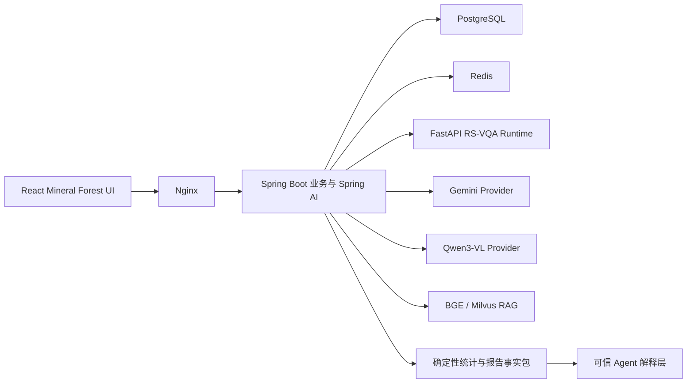

# RS-VQA v0.4.0 技术方案与功能介绍

> 状态：功能与验收完成（Gemini 外部真实调用保持未配置 fail-closed）
> 日期：2026-07-25
> 论文：跨模态特征融合机制及微调策略研究与应用

## 版本目标

v0.4.0 在 v0.3.0 全栈基线上完成四项升级：

1. 真实 `qdrop15 + predicted-soft` 不可变发布物接入与 smoke。
2. Mineral Forest 工作区的完整导航、归档、账户、预览和动效系统。
3. 可配置 Gemini 外部视觉 Provider。
4. 面向项目/批任务统计、解释与报告的可信 Agent。

本版本不缩减为单页 Demo，也不将外部模型能力混入论文模型结果。

## 架构

## 模块边界

| 模块 | v0.4 职责 |
| --- | --- |
| `apps/web` | 完整项目树、搜索、归档、账户菜单、分析模式、Lightbox、批量缩略图、Agent/报告 UI、统一动效 |
| `apps/gateway` | 所有权、命令、统计、报告版本、人工确认、Spring AI/Gemini 编排和审计 |
| `services/model-service` | 不可变 release 校验与 ViLT 推理；不管理用户和 Agent |
| `services/knowledge-service` | BGE/Milvus 引用检索；不替代 VQA |

## 模型来源

| 来源 | 当前状态 |
| --- | --- |
| `mock_demo` | 可用，仅工程演示 |
| `research_vilt_predicted_soft` | 已接入不可变发布 `rsvqa-hr-qdrop15-predicted-soft-20260724-8510bc9`；manifest、checkpoint、答案词表、preprocessor 和 runtime wheel 均完成 SHA-256 校验，Real CPU `/ready`、单图连续推理和 2×2 批量推理 smoke 通过 |
| `external_vlm_assist` | Spring AI Google GenAI Provider 已实现；无合法服务端配置时 fail closed 并显示未配置 |
| `external_vlm_qwen` | Spring AI OpenAI + DashScope 兼容端点已实现；Qwen3-VL-32B-Instruct；无合法 API Key 时 fail closed 并显示未配置 |
| `agent_synthesis` | 实施中；只解释工具事实 |

## UI 功能清单

- [x] 侧栏折叠后画布占满视口
- [x] 项目/对话联合搜索与空状态
- [x] 项目独立展开、活动项自动展开、状态持久化
- [x] 项目/对话重命名、移动、归档和恢复
- [x] 账户菜单与 Demo 退出闭环
- [x] 自定义分析模式 Popover
- [x] 单图与批量统一 Lightbox
- [x] 批量每页 20 张、宽屏 10×2、自适应降列
- [x] Motion token、路由/消息/抽屉空间动效和 reduced-motion
- [x] Agent 快速抽屉和完整项目分析视图
- [x] 报告预览、确定性事实、复核清单与版本信息
- [x] 项目/批任务报告草稿、重算、人工确认与 Markdown/JSON 导出
- [x] 用户语言、reduced-motion 与外部图像发送许可持久化
- [x] Agent 受控操作提案、一次性确认/拒绝、审计元数据和报告下载入口
- [x] 刷新后恢复当前会话；新建分析先完成项目树刷新再切换 active conversation，避免竞态回退

## Agent 工具目标

`current_model_release`、`model_capabilities`、`system_health`、
`conversation_history`、`conversation_vqa_results`、`project_summary`、
`project_conversations`、`project_vqa_statistics`、`batch_job_status`、
`batch_result_statistics`、`confidence_distribution`、
`unsupported_question_summary`、`failed_invocation_summary`、
`knowledge_search`、`audit_lookup`、`single_image_vqa`、
`create_batch_plan`、`report_draft_data`。

所有数量和分布由后端确定性计算。副作用动作必须人工确认。

当前运行态已注册上述 18 个目标工具；`single_image_vqa` 只存在于正式 Agent 目录，
不会进入只读 MCP Provider。为兼容既有调用，额外保留 `supported_question_types` 和
`search_knowledge` 两个旧别名，因此 `/api/v1/agent/tools` 当前共返回 20 项。
`create_batch_plan` 只计算图像规模、20 张分页、32 问题与 1000 组合上限，不会创建任务。

## 受控 Agent 操作

副作用操作不作为普通只读工具直接暴露给模型。Gateway 新增 `agent_action_proposal`
状态机和 `/api/v1/agent/actions` API：

1. 前端或未来的 Agent 规划层提交 `PENDING` 提案；服务端先做当前用户所有权和参数校验。
2. 用户在 UI 明确点击“确认执行”或“拒绝”。确认使用当前用户加数据库行锁；已完成、已拒绝、已过期的提案不会再次执行。
3. 执行结果、失败代码、稳定 request ID、参数 JSON、Provider/model、token 和成本字段写入提案与审计事件。
4. 创建批量任务只允许使用项目中已有且仍可访问的会话影像；影像会复制到批任务独立命名空间，
   避免删除原会话后破坏任务。异步 VQA worker 仅在数据库事务提交后启动。

当前受控动作：`create_batch_task`、`retry_batch_failures`、`save_report_draft`、
`export_report`、`archive_project`、`archive_conversation`、`archive_batch_task`。
`export_report` 的确认结果只返回受保护的下载 URL，不向浏览器暴露 Provider secret。

Agent 工作台的“受控操作”区按项目、批任务和对话上下文提供动作；待确认卡片展示动作摘要、
request ID、provider/token/cost 元数据和确认/拒绝按钮，完成后展示报告下载入口或执行结果。

## 数据与 API 变化

已新增：

- Flyway V5：用户设置、报告/版本、Provider 使用元数据和批任务归档补充字段。
- Flyway V6：持久化 Agent 会话，以及运行的项目、批任务和 Provider 审计上下文。
- 项目/对话 rename、move、archive、restore API。
- 项目、对话和批任务归档列表与恢复 API。
- 项目/批任务确定性统计 API。
- 报告事实包、版本重建、人工确认和 Markdown/JSON 导出 API。
- 用户语言、reduced-motion 和外部图片发送许可设置 API。

Gemini Provider 已实现：

- 使用 Spring AI `spring-ai-google-genai` 原生多模态接口，不读取浏览器会话。
- 必须同时设置显式启用开关与服务端 `GEMINI_API_KEY`；默认 `UNCONFIGURED`。
- 用户还必须在设置中显式允许外部图像发送；未许可时不会发起 Provider 请求。
- 外部回答固定标记 `external_vlm_assist` / `EXTERNAL_VLM`，记录 Provider/model、
  request ID、耗时和可用 token 用量；不会写成研究模型 release。
- SDK 超时与重试有上限，费用只保留可审计字段；没有版本化价目表时不伪造成本。

Qwen3-VL Provider 已实现：

- 使用 Spring AI `spring-ai-openai` 通过 DashScope OpenAI 兼容端点，模型 `qwen3-vl-32b-instruct`。
- 必须同时设置显式启用开关与服务端 `DASHSCOPE_API_KEY`；默认 `UNCONFIGURED`。
- 外部回答固定标记 `EXTERNAL_VLM`，记录 Provider `qwen`、model、request ID、耗时和可用 token 用量。
- Fail closed：未配置时 `configurationState=UNCONFIGURED`，调用抛 `ProviderNotConfiguredException`。
- 价格 $0.16/$0.64 per 1M tokens（DashScope 官方），适合大规模批量 VQA 成本控制。

可信 Agent 会话层已实现：

- 可绑定项目、批量任务、单个对话或整个工作区，历史在刷新后继续保留。
- 完整分析视图展示多轮问答、动态建议、执行阶段、工具时间线、结构化事实和 Trace ID。
- 项目与批量分析调用 `project_vqa_statistics`、`batch_result_statistics` 和
  `report_draft_data` 等确定性工具，Agent 不自行计数。
- 每轮当前只允许一次白名单工具调用；单会话最多 50 轮，避免无界循环。
- SSE 返回 accepted、tool_started、completed/failed 状态，客户端可以中止请求。
- Gemini 未配置时仍可使用全部确定性工具；不会把未配置状态伪装成生成式 Agent。

## 动效系统

统一令牌：

- press：100–160ms
- popover：125–200ms
- select：150–250ms
- modal/drawer：220–350ms
- `--ease-out: cubic-bezier(0.23, 1, 0.32, 1)`
- `--ease-in-out: cubic-bezier(0.77, 0, 0.175, 1)`
- `--ease-drawer: cubic-bezier(0.32, 0.72, 0, 1)`

只为反馈、空间关系和防止突变添加动画。所有位置动画均提供 reduced-motion 变体。

## 安全边界

- 不读取或提交 `.env`、token、Cookie、密码、SSH key、AutoDL/Google 凭据。
- 不提交模型、checkpoint、预测 JSONL、PDF、上传图片或数据卷。
- Gemini key 只存在于服务端 secret。
- 研究模型、外部 VLM、Mock 和 Agent 来源不可混淆。
- 不声称开放式 VQA、检测、变化检测、零样本能力或 SOTA。

## 测试证据

基线（2026-07-24）：

| 范围 | 结果 |
| --- | --- |
| React | 3 files / 7 tests；typecheck/build 通过 |
| Java | 17 tests，15 passed、2 integration skipped |
| 模型服务 | 24 passed（含 release wheel provenance、兼容层和单例加载测试） |
| Compose config | 通过 |

阶段性证据（工作区交互与媒体预览板块）：

| 范围 | 结果 |
| --- | --- |
| React | 5 files / 13 tests；typecheck/build 通过 |
| Java | 19 tests，17 passed、2 integration skipped |
| Playwright | 单图 Lightbox、22 图分页、侧栏全宽折叠、桌面/平板/移动端路径通过 |
| 构建优化 | 路由懒加载并拆分 React、数据、Motion、UI vendor，无超大 chunk 警告 |

真实 Runtime smoke 已完成；v0.4 的全量视觉与跨服务验收仍在实施中。

确定性分析与报告板块：

- Flyway V5 已在 PostgreSQL 17.5 实际数据卷迁移成功，Hibernate schema validate 通过。
- Java 共 24 tests，22 passed、2 integration skipped；包含完整工具目录与当前用户审计隔离测试。
- HTTP smoke 已完成“项目统计 → 报告草稿 → 人工确认 → Markdown/JSON 导出”，两种导出均返回 200。
- smoke 中题型/来源/低置信度计数与当前持久化调用记录一致；报告来源标记为
  `deterministic_backend_statistics`，不会冒充研究模型或 Agent 输出。
- React 共 5 files / 16 tests；新增 22 图分页、Object URL 释放、报告事实与复核清单、
  reduced-motion 偏好持久化测试，typecheck 与 production build 通过。
- Docker 镜像内再次完成 16 项 React 测试和 production build。
- Playwright 已覆盖“生成项目报告草稿 → 查看确定性统计与复核清单 → 人工确认 →
  Markdown/JSON 下载”，并保存确认态桌面截图。
- 批量图像网格保持每页最多 20 张：宽屏 10×2、中间宽度自适应、手机端 2 列。
- 单批图像上限由 32 张提升为 200 张，并保留 120 MiB 总量与 1000 个图像×问题组合上限；
  超限、重复或单图过大均显式提示，不再静默截断。上传区是唯一入口，空态显示“上传图像”，
  已选图后切换为“添加图像”。
- Gemini Provider 边界测试覆盖默认未配置、描述符不泄露凭据、无配置调用 fail closed；
  E2E 覆盖“未许可阻断 → 许可后仍因服务端未配置阻断 → 不产生半条会话记录”。
- Docker/Flyway 已实测从 V5 升级至 V6；Playwright 已覆盖“创建项目级 Agent 会话 →
  项目确定性统计 → 报告事实包 → 页面刷新后两轮历史与 Trace 保留”，并保存桌面截图。
- V9 新增 Agent 受控操作提案表；Java 28 tests 中 26 passed、2 integration skipped，
  覆盖提案过期、其他用户隔离、拒绝阻断和重复确认幂等；React typecheck、6 个 FeaturePages 测试通过。
- Agent UI 已提供项目/批任务/对话上下文的受控操作表单和待确认卡片；真实 Docker/Flyway
  迁移与端到端点击验收待本阶段 Gateway 重建后完成。
- Docker Gateway 重建后已实际应用 Flyway V9；API smoke 验证归档提案 `PENDING → COMPLETED`，
  重复确认仍返回 `COMPLETED` 且不重复执行。Playwright 受控操作用例验证了 Agent 页面
  “提交提案 → 待人工确认 → 确认执行 → 已完成 → 归档列表可见”闭环。
- Web 重新构建后，Agent 项目分析 Playwright 用例通过；Real Runtime 下低置信度答案显示为
  “低置信度，请复核”，来源详情仍明确标记 `研究 ViLT predicted-soft`，不会被测试断言误当作 Mock。
- 真实项目影像受控动作 smoke：`create_batch_task` 提案确认后创建 3 项任务，事务提交后 worker
  完成 `COMPLETED`，3/3 成功、0 失败；任务图像使用独立批任务存储副本。
- 会话恢复竞态已修复：活动项目/会话写入当前浏览器 `sessionStorage`，刷新时校验仍属于当前用户；
  新建项目/对话在项目树刷新完成后才切换活动项。Playwright 并行 worker 下单图连续多轮与刷新
  用例通过，避免旧会话重新显示。
- 移动端固定抽屉在合成层动画期间可能返回陈旧 viewport box；导航仍通过真实 DOM click 事件执行，
  侧栏关闭、路由切换与批量页面可用性已连续运行 3 次通过。
- 最终全量 Web E2E：12/12 通过；包含桌面、笔记本、平板、移动端、RAG citation、批量 20 张分页、
  超过 32 张上传、Agent 受控操作、报告导出与 Gemini fail-closed。
- 最终 Docker Compose（含 `--profile rag`）9 个服务均返回 healthy；Web 入口为
  `http://127.0.0.1:8088`。知识服务重新冷启动后，BGE/Milvus citation E2E 通过。
- 在完整 Compose 依赖就绪后，`RSVQA_COMPOSE_INTEGRATION=true RSVQA_RUN_MCP_INTEGRATION=true
  mvn -Dtest=PersistenceIntegrationTest,McpProtocolIntegrationTest test` 已通过 2/2；Flyway
  当前版本为 V9，MCP 只读目录为 19 项且明确不包含 `single_image_vqa`。
- 中文口语数量问法新增“有几条路？”映射，规范化为 `How many roads are there?`；模型服务
  25/25 测试通过。Real Runtime 端到端返回 `research_vilt_predicted_soft`，不再误判为超范围。
- 新增答案形态一致性提示：若 count 返回非数字、presence/comp 返回非 yes/no，系统不修改
  论文模型原始预测，只在消息 metadata 与 UI 标记“答案形式异常，请复核”。当前 React
  18/18、Java 常规 29 tests（27 passed、2 integration skipped）通过。

真实 Runtime 证据（2026-07-25）：

- release ID：`rsvqa-hr-qdrop15-predicted-soft-20260724-8510bc9`
- research commit：`8510bc9cd1738f2cc3c61a3eff3b0faab0cbe556`
- checkpoint SHA-256：`2426770af96a6f41b30e081c9719d6582471fab091e4b44ba2c3068d6e227109`
- answer vocabulary SHA-256：`23592881181ac284e46292921ce14d329eb437c1e3913b2e2f8a05ff9b75f99a`
- runtime wheel SHA-256：`cc604c70c65974dbd5826edf6f1bfc24766b17b27926087f154cb844a9d1f9ab`
- Real CPU 容器 `healthy`；`/ready` 和 `/models/current` 返回 `type_source_mode=predicted_soft`。
- 单图 smoke：`Is there a road?` → `yes`，来源为 `research_vilt_predicted_soft`。
- 批量 smoke：2 张 × 2 问题，4 项均返回同一研究来源和 release ID。
- CPU 多线程推理的概率可能出现末位浮点差异；答案、题型和 provenance 保持一致。
- Real 业务链路完成 Demo 登录、项目/对话、图像上传和多轮提问；PostgreSQL 中
  `model_invocation` 保留 `research_vilt_predicted_soft`、release ID 与三项制品哈希。
- Playwright 核心 Mock Profile 10 项通过；RAG Profile 冷启动后知识导入、BGE 检索与
  Milvus citation 1 项通过；移动侧栏用例额外连续运行 5 次通过。
- 当前 Docker Desktop 内存不足以同时稳定承载 Real ViLT 与完整 Milvus/BGE Profile，
  因此两组验收采用相同持久化数据卷分阶段运行，不声称本机已通过全服务并行压测。

### 2026-07-25 模型异常与侧栏交互审计

- 页面截图中的 `count -> no`、`count -> yes` 等结果已确认来自真实
  `research_vilt_predicted_soft` runtime；模型服务 `/ready` 返回 `mode=real`，并非 Mock、前端
  映射或答案改写。应用只额外标记“答案形式异常，请复核”，保留原始输出。
- 该 release 是 RSVQA-HR grouped-answer 的 55 类闭集分类器。当前 `data/test-images` 中的
  smoke 影像来自 USGS WMS，未带 RSVQA-HR 金标，也不能代表论文 test/test_phili 分布；在域外
  影像上出现高置信度错误是已知泛化风险，不能据此计算论文 OA/AA。
- `predicted-soft` 仅使用文本预测题型作为软条件，不使用人工 `question_type_id` 或答案类型
  hard mask。模型答案词表同时包含 `yes/no` 和数字，因此 count 问题在域外输入上可能把
  `yes/no` 排到最高；softmax 置信度不是正确率保证。正式诊断应使用研究仓库已审计的
  `Data/9603.tif` 等同一图像-问题-金标对，比较原研究 runtime 与应用 adapter 的答案、top-k、
  题型概率和制品哈希；当前本机未找到这些图像，未将 smoke 图冒充评测集。
- “项目”标题行的 `+` 已改为 28×28、无负偏移的完整按钮；新建项目输入器被封装为独立交互区，
  空输入点击外部自动收起，`Escape` 始终收起，已有文字不会因外部点击被静默丢弃。新增两项
  React 行为测试；Docker Web 构建内全量 20/20 测试、typecheck 和 production build 通过。
- **模型选择器与滚动条 UI 优化**：
  1. 修复顶部模型选择器 Trigger 按钮的 Flex 布局：为名称与描述创建独立 `.model-selector-info` 容器，图标与箭头固定宽度；桌面 Trigger 使用 `292–340px` 响应式宽度，主模型名优先完整展示，次级版本说明仅在空间不足时截断。
  2. 修复全站滚动条入侵（Scrollbar Intrusion）重叠问题：设置、知识库、审计、归档、批量 VQA 与报告页统一拆分为外层 `.page-scroll` 滚动视口和内层居中布局容器，不再让滚动条与表单、开关和卡片共享同一内容边界；滚动视口使用 `scrollbar-gutter: stable both-edges` 保持左右留白稳定。
  3. React 全量 21/21、TypeScript typecheck 与 production build 通过；新增 DOM 回归断言，禁止再次把 `.page-scroll` 与 `.settings-layout` 合并到同一元素。

## 已知限制

1. 研究 runtime wheel 当前通过应用侧兼容层适配 Transformers 的 `head_mask` 调用签名；研究仓库应在后续发布中将该兼容修复回写并生成新的不可变 runtime artifact。当前已完成真实 CPU smoke，但尚未完成全量 GPU/远程 worker 压测。
2. 当前没有合法 Gemini API 配置，不能进行真实外部 Provider smoke；已完成未配置状态、图像许可、
   错误分类和不产生半条会话记录的 contract/E2E 验证。配置服务端 secret 后无需修改代码即可启用。
3. Docker Desktop 同时运行 Real ViLT 与完整 BGE/Milvus profile 的内存余量有限；本机采用分阶段持久化
   数据卷验收，不将其描述为并发压测结果。

## 下一步

后续可选工作：真实 Gemini API smoke（需用户提供合法服务端 key）、远程 GPU worker 压测、真实账户
与多用户部署评估。这些不阻塞 v0.4.0 当前本地论文演示闭环。
