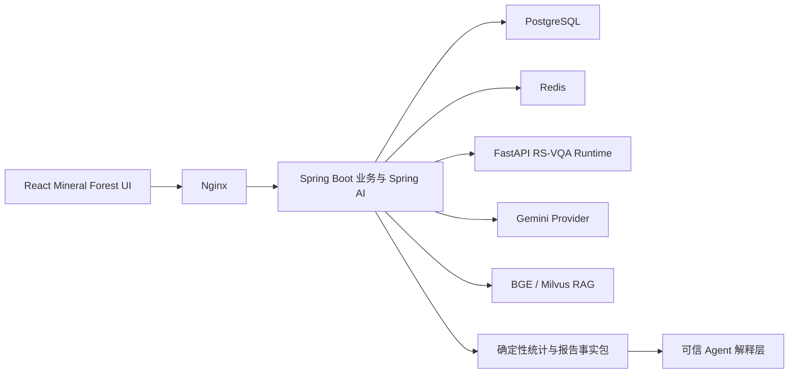

# RS-VQA v0.4.0 技术方案与功能介绍

> 状态：实施中
> 日期：2026-07-24
> 论文：跨模态特征融合机制及微调策略研究与应用

## 版本目标

v0.4.0 在 v0.3.0 全栈基线上完成四项升级：

1. 真实 `qdrop15 + predicted-soft` 不可变发布物接入与 smoke。
2. Mineral Forest 工作区的完整导航、归档、账户、预览和动效系统。
3. 可配置 Gemini 外部视觉 Provider。
4. 面向项目/批任务统计、解释与报告的可信 Agent。

本版本不缩减为单页 Demo，也不将外部模型能力混入论文模型结果。

## 架构

## 模块边界

| 模块 | v0.4 职责 |
| --- | --- |
| `apps/web` | 完整项目树、搜索、归档、账户菜单、分析模式、Lightbox、批量缩略图、Agent/报告 UI、统一动效 |
| `apps/gateway` | 所有权、命令、统计、报告版本、人工确认、Spring AI/Gemini 编排和审计 |
| `services/model-service` | 不可变 release 校验与 ViLT 推理；不管理用户和 Agent |
| `services/knowledge-service` | BGE/Milvus 引用检索；不替代 VQA |

## 模型来源

| 来源 | 当前状态 |
| --- | --- |
| `mock_demo` | 可用，仅工程演示 |
| `research_vilt_predicted_soft` | **尚无真实发布物，不能伪造 release ID 或 SHA-256** |
| `external_vlm_assist` | Provider 实施中；无合法 key 时显示未配置 |
| `agent_synthesis` | 实施中；只解释工具事实 |

## UI 功能清单

- [ ] 侧栏折叠后画布占满视口
- [ ] 项目/对话联合搜索与空状态
- [ ] 项目独立展开、活动项自动展开、状态持久化
- [ ] 项目/对话重命名、移动、归档和恢复
- [ ] 账户菜单与 Demo 退出闭环
- [ ] 自定义分析模式 Popover
- [ ] 单图与批量统一 Lightbox
- [ ] 批量每页 20 张、宽屏 10×2、自适应降列
- [ ] Motion token、可中断空间动效和 reduced-motion
- [ ] Agent 快速抽屉和完整项目分析视图
- [ ] 报告预览与版本信息

## Agent 工具目标

`current_model_release`、`model_capabilities`、`system_health`、
`conversation_history`、`conversation_vqa_results`、`project_summary`、
`project_conversations`、`project_vqa_statistics`、`batch_job_status`、
`batch_result_statistics`、`confidence_distribution`、
`unsupported_question_summary`、`failed_invocation_summary`、
`knowledge_search`、`audit_lookup`、`single_image_vqa`、
`create_batch_plan`、`report_draft_data`。

所有数量和分布由后端确定性计算。副作用动作必须人工确认。

## 数据与 API 变化

计划新增：

- Flyway V5：用户设置、Agent 会话、报告/版本、Provider 使用元数据和归档补充字段。
- 项目/对话 rename、move、archive、restore API。
- 归档列表和恢复 API。
- 项目/批任务确定性统计 API。
- 报告事实包、草稿、保存和导出 API。
- Gemini Provider 状态、流式调用和审计元数据。

## 动效系统

统一令牌：

- press：100–160ms
- popover：125–200ms
- select：150–250ms
- modal/drawer：220–350ms
- `--ease-out: cubic-bezier(0.23, 1, 0.32, 1)`
- `--ease-in-out: cubic-bezier(0.77, 0, 0.175, 1)`
- `--ease-drawer: cubic-bezier(0.32, 0.72, 0, 1)`

只为反馈、空间关系和防止突变添加动画。所有位置动画均提供 reduced-motion 变体。

## 安全边界

- 不读取或提交 `.env`、token、Cookie、密码、SSH key、AutoDL/Google 凭据。
- 不提交模型、checkpoint、预测 JSONL、PDF、上传图片或数据卷。
- Gemini key 只存在于服务端 secret。
- 研究模型、外部 VLM、Mock 和 Agent 来源不可混淆。
- 不声称开放式 VQA、检测、变化检测、零样本能力或 SOTA。

## 测试证据

基线（2026-07-24）：

| 范围 | 结果 |
| --- | --- |
| React | 3 files / 7 tests；typecheck/build 通过 |
| Java | 17 tests，15 passed、2 integration skipped |
| 模型服务 | 19 passed |
| Compose config | 通过 |

v0.4 最终测试、E2E、视觉截图和真实 release smoke 将在实施完成后补充。

## 已知限制

1. 研究仓库当前未发现 `model-release.json`，真实模型仍为外部门槛。
2. 当前没有合法 Gemini API 配置，不能进行真实外部 Provider smoke。
3. v0.4 功能仍在实施，本文档不得作为完成声明。

## 下一步

先完成工作区交互和动效基础，再扩展持久化命令、统计、报告与 Gemini/Agent；真实 release 一旦出现立即进行 fail-closed 消费验收。
